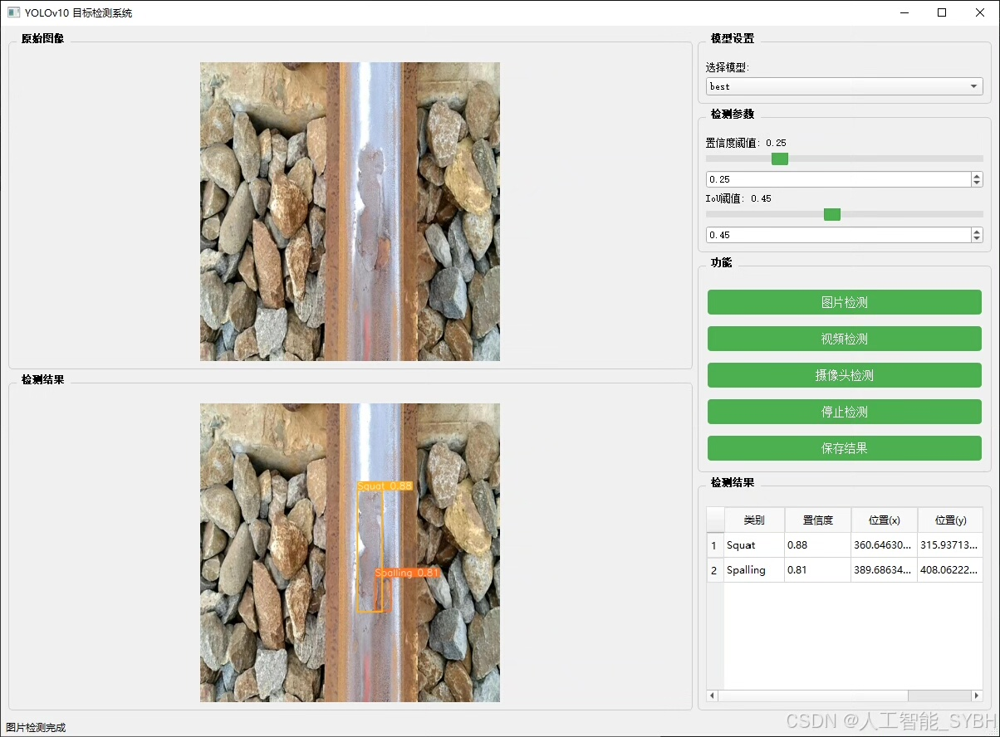
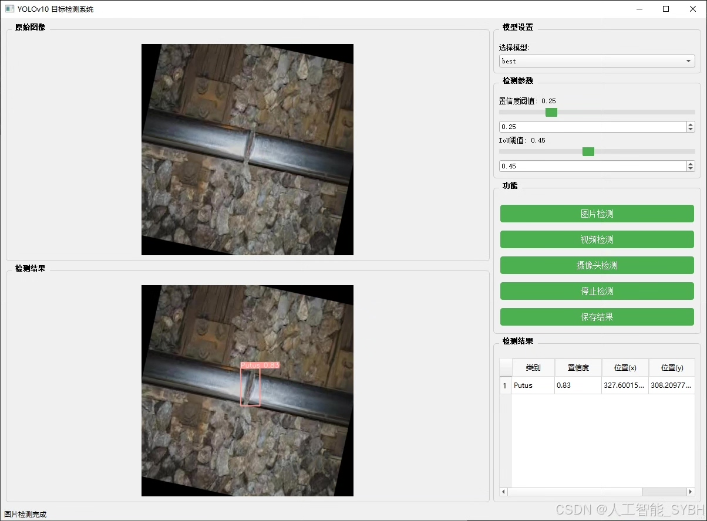
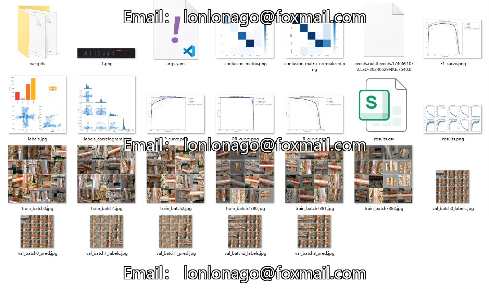
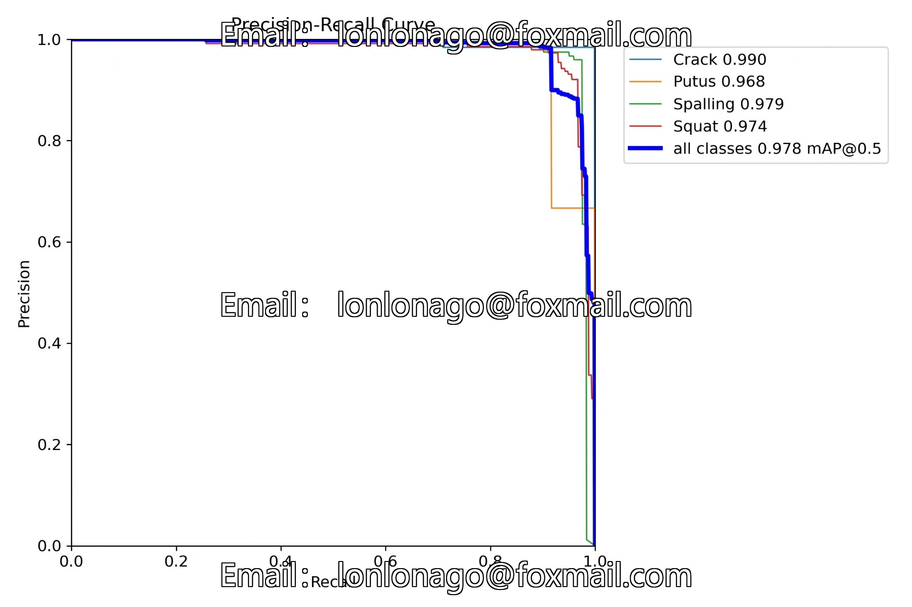
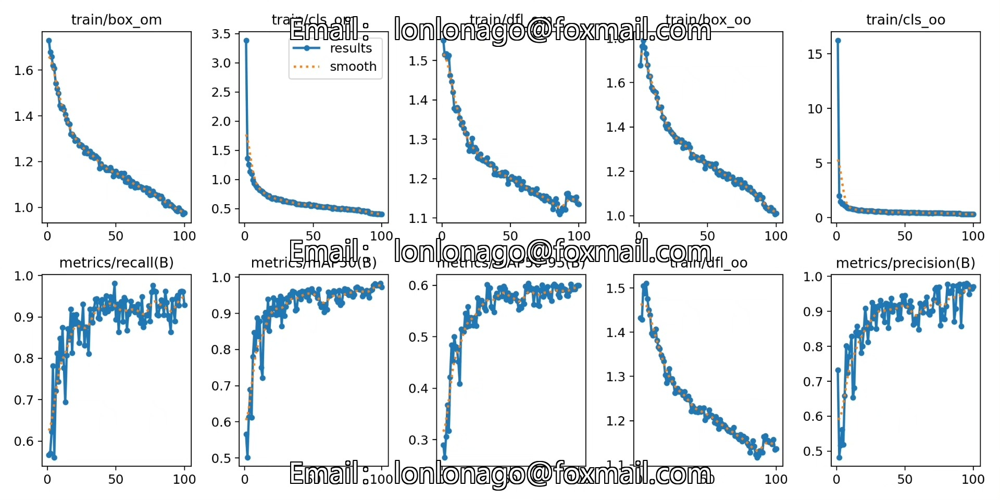
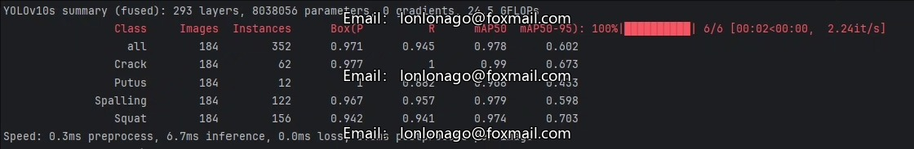
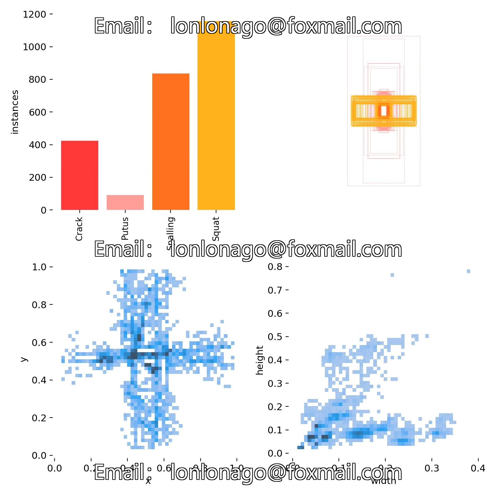
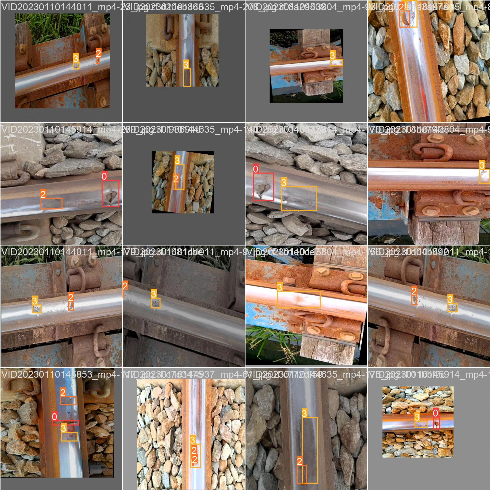

# Based on deep learning YOLOv10 for railway track defect detection system (YOLOv

## Body

This project is based on the YOLOv10 object detection algorithm, developing a high-efficiency and precise intelligent railway track defect detection system. It can automatically identify four common defects on the rail surface: cracks (Crack), breaks (Putus), spalling (Spalling), and squatting (Squat). The system was trained and optimized on a dataset containing 1312 training images, 184 validation images, and 97 test images. It can detect rail defects in real time, assisting railway maintenance personnel in quickly identifying problem areas, thereby enhancing railway safety and operational efficiency.

The company's products have been granted the YOLO official commercial license certification.

We provide after-sales service.

After payment, we will provide WeChat ID for any questions.

Environment configuration: We will provide an instructional tutorial on how to set up the environment. We offer Q&A via WeChat.

Remote installation services: If you need remote configuration, an additional fee of 69 is required.
If the configuration fails, all fees are refunded (excluding special old computers only refunding installation fees).

Retraining the dataset: After setting up the environment, you can train on your own computer.
If you need us to retrain, just pay 69 plus computing power fees (2.5 yuan/hour)

## Images

## Payment

Here is a pay link on Stripe ( https://buy.stripe.com/3cs8yP7sY87d0vu9AB ). Please contact me lonlonago@foxmail.com after funding $89, and I will send you a complete data files , thank you!

